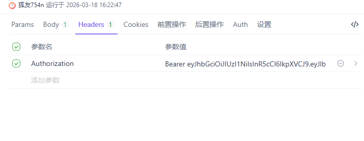

# TaskBoard - 全栈实时任务协作平台

**技术栈**：Go + Gin + PostgreSQL + Redis + WebSocket + React + TypeScript + TailwindCSS

**核心功能**：
- 用户注册/登录（JWT）
- 实时拖拽看板（多人同步）
- WebSocket 实时通信
- Docker 只跑数据库（开发友好）

**一键启动**：
```bash
# 后端
cd backend && go run main.go

# 前端
cd frontend && npm start

# 接口测试
注册接口url: http://127.0.0.1:8080/auth/register
- 使用json数据
{"username":"testuser","email":"test@example.com","password":"123456"}

登录接口URL：http://127.0.0.1:8080/auth/login
- 使用json数据
{"email":"test@example.com","password":"123456"}
需要在请求头中加入Authorization：Bearer {token}

剩下接口在main.go